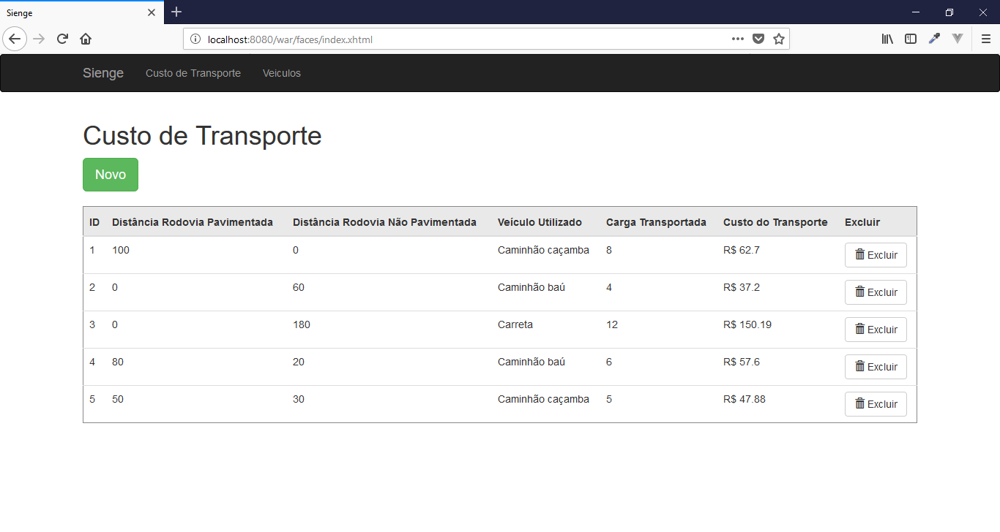
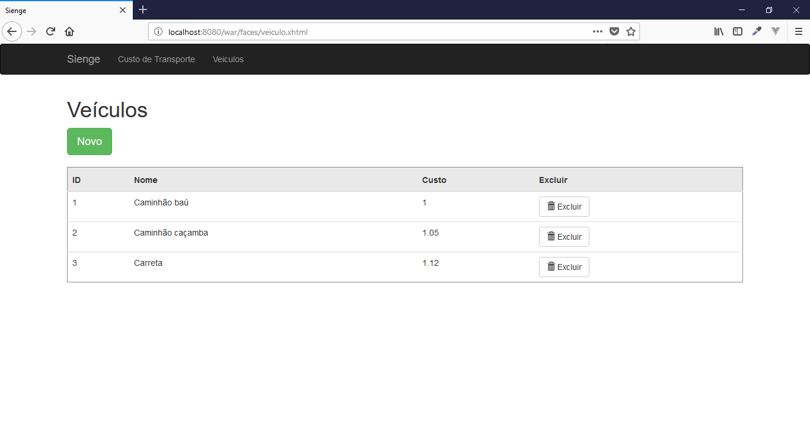
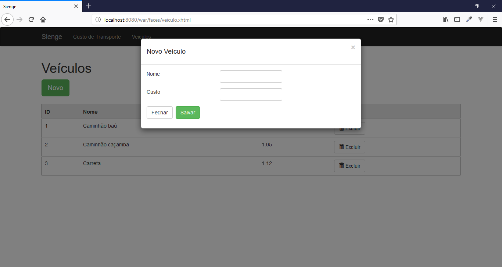
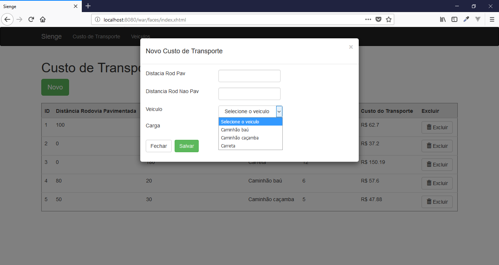
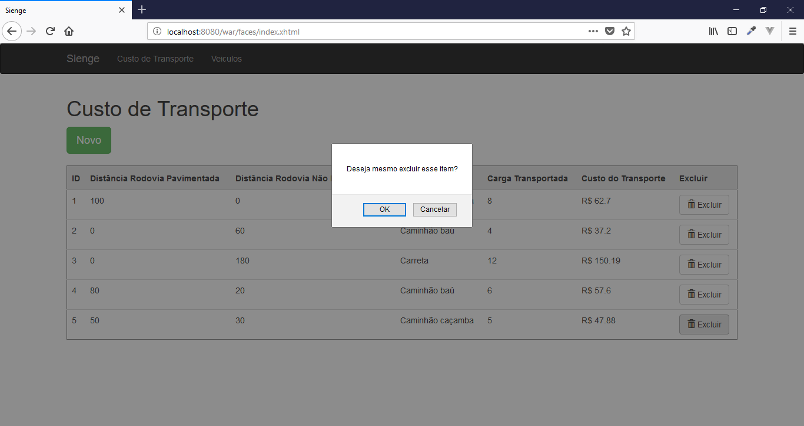
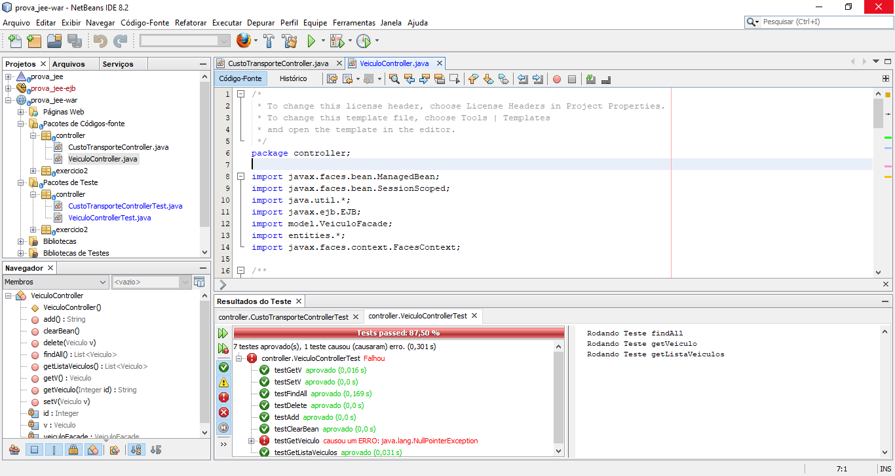
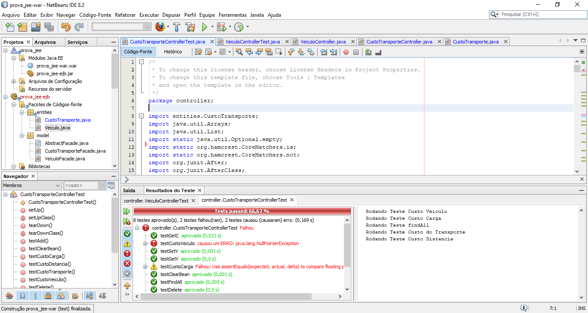

# Custo de Transporte

Prova da Softplan realizada com Java EE.

## Características

- CRUD
- MVC
- ORM
- DataTable
- Validator

## Requisitos

- NetBeans 8.2
- Java JDK 1.8
- Glassfish = 4.1
- MySql >=5

## Tecnologias

- Java
- EJB
- JPA
- JSF
- CSS
- JS
- BootsFaces
- JUnit
- MySql

## Instalação

```
$ git clone https://github.com/danilomeneghel/prova_jee.git

$ cd prova_jee

```

Então crie um banco de dados com o nome prova_jee no seu Mysql. Você encontra o dump na raiz do projeto (prova_jee.sql) e pode efetuar importação da seguinte forma:

```
$ mysql -u <your user> -p <your password>

mysql> create database `prova_jee`;

mysql> use `prova_jee`;

mysql> source prova_jee.sql

```

## Configuração Glassfish

Inicie o Glassfish e abra no navegador: http://localhost:4848/ <br><br>

Vá para "Recursos/JDBC/JDBC Connection Pools", crie a conexão com o banco de dados(pool). <br>

Depois, vá para "Recursos/JDBC/JDBC Resources", crie um nome para "jndi" (ProvaJEE) e selecione a Pool criada anteriormente. <br>

Ao concluir a configuração, basta abrir o NetBeans e executar o projeto no navegador. <br>
http://localhost:8080/prova_jee-war/

## Licença

Office is licensed under <a href="LICENSE">The MIT License (MIT)</a>.

## Screenshots

### Sistema

<br><br>
<br><br>
<br><br>
<br><br>
<br><br>

### Testes Unitários

<br><br>
<br><br>
